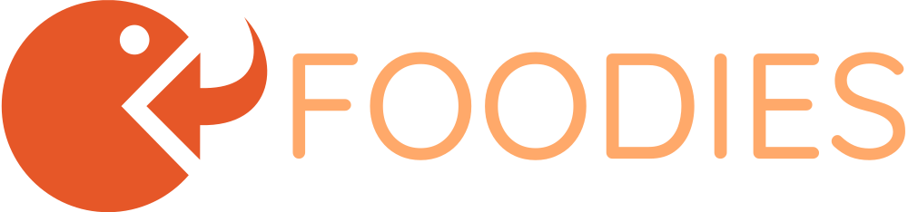

# Foodies - Deliver happiness to your door




Welcome to one of my portfolio projects! Here you'll find examples of my work in web development.

Explore it and see what I can do!

## Technology Stack

- Front-end: ReactJS + Tailwind + PostCSS + [Framer Motion](https://www.framer.com/motion/)

- Database: Firebase

- Tool: [ViteJS](https://vitejs.dev/)

## Development

- Set up Firebase and add configs to `.env`:

```
VITE_FIREBASE_API_KEY=
VITE_FIREBASE_DB_URL=
VITE_FIREBASE_AUTH_DOMAIN=
VITE_FIREBASE_PROJECT_ID=
VITE_FIREBASE_STORAGE_BUCKET=
VITE_FIREBASE_MESSAGING_ID=
VITE_FIREBASE_APP_ID=
```

- Install Vite using Yarn:

```
yarn create vite
```

- Install packages:

```
yarn
```

- Start app:

```
yarn dev
```

# Acknowledgement

- Web Materials & Inspired by [Full Stack Food Delivery App - React Redux Reducer, Firebase](https://www.youtube.com/watch?v=kmU7uX3ZHJc&ab_channel=VetrivelRavi)

- Logo by [LOGO.com](https://logo.com/)

